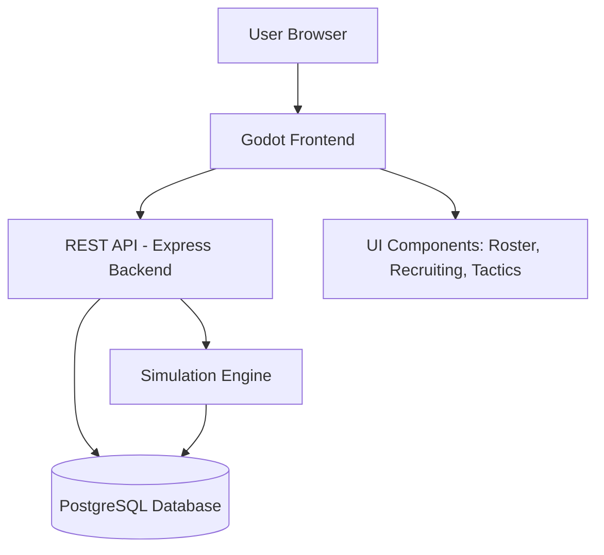

# College Basketball Manager
A web-based college basketball management simulator focused on all the off-court activities needed to lead your team to glory.

## Overview
The goal of this project is to create a modern web-based simulation focused on the full experience of college basketball program management. The user will select a school of their choice and be tasked with building the program into a championship contender. They will be responsible for recruitment, staff management, player transfers, player development, opponent scouting, and tactical preparation. The main goal of the game is to provide an in-depth simulation of college basketball.

## Motivation and Background
Sports management simulations have grown in popularity because they emphasize strategic thinking, long-term planning, and data-driven decision-making. Football Manager demonstrates how compelling a game can be when players focus on tactics, scouting, and roster building rather than direct gameplay. However, there is no modern, dedicated college basketball management simulator that captures the complexity of recruiting pipelines, conference play, staff roles, and player development.

College Hoops 2K8’s Legacy Mode remains the closest example, but it is nearly two decades old and requires outdated hardware. Modern college sports games like CFB 27 show strong demand for management-focused experiences, yet no equivalent exists for basketball. This project aims to fill that gap by offering a contemporary, accessible, web-based solution.

## Comparable Solutions

### Football Manager
Football Manager is a long-running sports management simulation where players control every strategic aspect of running a football club, including scouting, transfers, tactics, player development, and match-day decisions, without directly controlling the athletes on the field.

Similarities:
- Indirect control
- Tactical depth
- Long-term program building

Differences:
- Focuses on professional soccer, not college athletics
- No NCAA-style recruiting or transfer portal
- Different staff and prestige systems

### College Hoops 2K8 – Legacy Mode
College Hoops 2K8 includes a “Legacy Mode” where players manage a college basketball program by recruiting, developing players, and navigating conference play. Gameplay includes on-court control, but the management systems are deep and well-regarded.

Similarities:
- Recruiting pipelines
- Scouting reports
- Prestige systems
- Player progression

Differences:
- Includes on-court gameplay
- Outdated technology
- No modern transfer portal mechanics

### CFB 27
CFB 27 is a modern college football simulation game blending team management, recruiting, roster building, and game-day strategy. While players can engage with on-field gameplay, the core loop emphasizes program building, recruiting pipelines, staff decisions, and long-term dynasty progression.

Similarities:
- Recruiting logic
- Transfer portal integration
- Staff systems
- Program prestige

Differences:
- Focuses on football, not basketball
- Different tactical and roster structures

## Project Scope

### Included Features
- Recruiting system (interest levels, scouting, visits, commitments)
- Transfer portal logic
- Player development and progression
- Staff roles and training boosts
- Tactical system (offensive/defensive schemes, rotations, tempo)
- Game simulation engine
- Season progression (conference play, tournaments, off-season)
- Web-based UI for roster and program management

### Excluded Features
- Direct player control during games
- Real-time gameplay
- Multiplayer functionality (initially)

## Technologies

### Frontend
Godot Engine (Web Export): Suitable for UI-heavy simulation interfaces, supports HTML5 export, lightweight, and easy to iterate.

### Backend
Node.js with Express: Provides a simple, flexible REST API for simulation logic, recruiting calculations, and data retrieval.

### Database
SQLite (development) and PostgreSQL (production): Store player data, team profiles, staff roles, recruiting information, and season history.

### Hosting
GitHub Pages for the frontend and a service like Railway or Render for the backend API and database.

### Libraries
- Godot UI components
- Express middleware
- pg or sqlite3 database drivers
- A randomization library (e.g., Chance.js) for simulation events

## Alternative Technologies Considered

### Unity vs Godot
Unity offers more advanced 3D tools but is heavier, slower to iterate, and less suited for UI-centric management sims. Godot is lightweight, open-source, and exports cleanly to the web, making it a better fit for this project.

### Desktop App vs Web App
A desktop app would require installation and manual updates. A web app allows instant access, automatic updates, and broader device compatibility.

### MySQL vs PostgreSQL
PostgreSQL offers better JSON support, indexing, and reliability for complex simulation data.

## Architecture Overview

## Technical Approach

### Core Systems
- Recruiting engine: interest levels, scouting accuracy, visits, commitments
- Transfer portal: player movement logic, eligibility, roster needs
- Player development: attribute progression, training effects, morale
- Staff system: coaches, trainers, scouts, attribute boosts
- Tactical engine: offensive/defensive schemes, tempo, rotations
- Game simulation: possession-based or event-driven model
- Season engine: scheduling, conference play, tournaments

### Data Structures
- Player objects (attributes, ratings, potential, morale)
- Team objects (prestige, staff, tactics)
- Recruiting objects (interest, scouting reports)
- Game objects (events, stats, outcomes)

### Simulation Design
Games will be simulated using a possession-based model influenced by tactics, player ratings, fatigue, and randomness. Results will feed into player development, morale, and season progression.

## Timeline

### Fall Semester
- Weeks 1–2: Requirements and design document
- Weeks 3–5: Database schema and player/team models
- Weeks 6–8: Recruiting system prototype
- Weeks 9–11: Staff and player development systems
- Weeks 12–14: Godot UI prototype
- Week 15: Milestone demo (This is my estimated graduation time, anything after this is simply speculated)

### Winter Break
- Polish UI and refine recruiting logic

### Spring Semester
- Weeks 1–4: Game simulation engine
- Weeks 5–8: Tactics system
- Weeks 9–12: Season progression and polish
- Weeks 13–15: Final testing, documentation, and presentation

### Risks
- Scope may become too large
- Simulation will be very complex, I will try to make it as simplistic as possible while still staying realistic
- UI may take longer than expected
- Balancing realism versus accessibility may be challenging

## New Concepts to Learn
- Godot UI system and web export
- REST API development
- Managing Large Scale databases (undecided if the players/coaches/staff with by generated or based off of real life)
- Sports simulation modeling (finding a good way to simulate what teams win based off of their rosters, coaches, morale, ect.)
- NCAA recruiting structures
- Web deployment pipelines
- GitHub Pages workflow

## References

[1] Football Manager — Sports Interactive  
https://www.footballmanager.com/

[2] College Hoops 2K8 — Wikipedia  
https://en.wikipedia.org/wiki/College_Hoops_2K8

[3] CFB 27 — Official Website  
https://www.cfb27.com/

[4] Godot Engine Documentation  
https://docs.godotengine.org

[5] NCAA Recruiting Rules and Calendar  
https://www.ncaa.org/sports/2021/7/19/recruiting-calendars.aspx

[6] KenPom — College Basketball Advanced Stats  
https://kenpom.com/

[7] Render — Web Hosting Documentation  
https://render.com/docs

- [Home]({{ '/' | relative_url }})
- [Bibliography]({{ '/docs/bibliography.md' | relative_url }})

